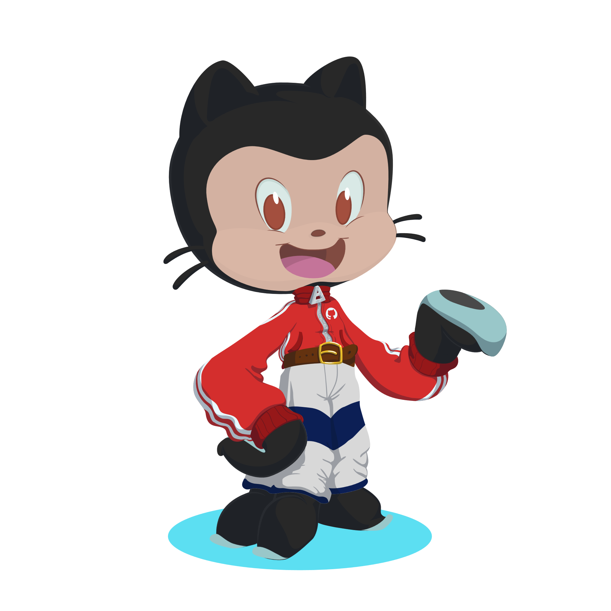

# Hello! Be welcome to my profile!

- I'm a **full-stack developer** working with various technologies. I am also an **AI researcher**.
- My main language is **Java**, but I build applications using many other tech stacks.
- Feel free to check out my projects and reach out with any questions or comments &#x1F643;
 

## 🛠️ Back-end technologies
<a href = "github.com/fernandotcordova">
    <!--Java photo-->
    
     
    <!-- Spring photo -->
    
    <!--Python photo-->
    
    <!-- NodeJS image -->
    
    <!-- PostgreSQL Image -->
    
    
    
</a>

## 🎨 Front-end technologies
<a href="github.com/fernandotcordova">
    
    
    
    <!-- CSS image -->
    
    
</a>

## ⚙️ DevOPs

## 🔬 Current Focus & Research
- 🔭 I’m currently working on **[Nome de um Projeto ou área]**
- 🧠 I’m currently researching **Artificial Intelligence & Machine Learning**

## How to contact me

  

---

